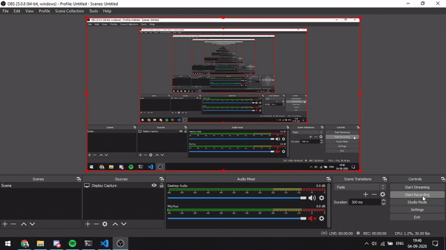

# MsTeam-AutoAttend
### Attends meetings for you just ping on discord

## How to install ⬇

1. First of all clone the repository by git clone https://github.com/madrix01/MsTeam-Auto.git.
2. Install python libraries just type ```pip install -r requirements.txt``` in your command shell, update your chrome browser and intall chrome drivers
3. Create file teams.json in the main directory
      - Add team id from the team link 
       for example if my team link is https://teams.microsoft.com/_#/school/conversations/General?threadId=19:{teamID}@thread.tacv2&ctx=channel
       Add this id corresponding to your team name in teams.json
      - Add your login info 
      - Add your discord bot token which can be obtained by following steps from below link
       https://www.youtube.com/watch?v=nW8c7vT6Hl4&list=PLW3GfRiBCHOhfVoiDZpSz8SM_HybXRPzZ&index=2&t=0s
4. For installing pip use sudo apt install python3-pip.
5.For installing the discord library use python3 -m pip install -U discord.py.
6.Refer to this documentation for more:https://discordpy.readthedocs.io/en/latest/intro.html#installing.
6. Run the ```bot.py``` file and voila!
7. Go to your discord and type .help to get list of all the commands.

### Tech I have used 👩‍💻
 1. Discord.py for discord bot
 2. Selenium for web automation
 
### Todo 📝
- [ ] Set remiders for meeting 
- [ ] More interactive bot 
- [ ] Adding google meet functionality

## Here's a quick demo 


## Made By
U19EC055 Shlok Patel
U19EC002 Harshit Chauhan

