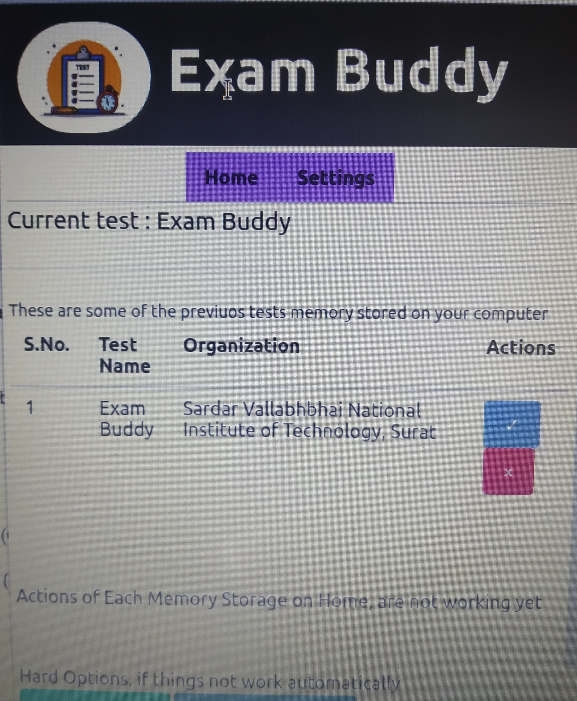
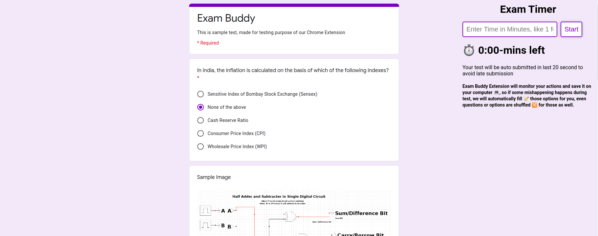
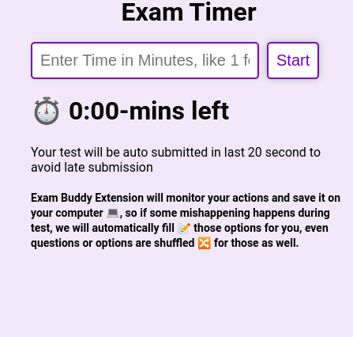
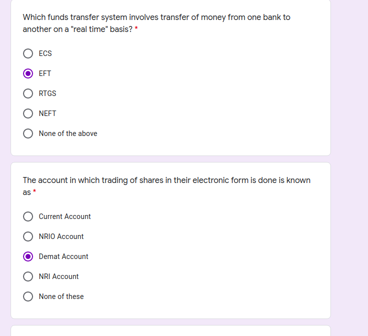

## Team Name - Twinkling Connoisseur
### Team Member - Pooja Paliwal [ U19EC063 ]
### Team Member 2 - Pushpendra Vishwakarma [ U19EE003 ]

# Exam Buddy
Exam Buddy is a Chrome Extentsion which provides some essential Exam tools which are somewhere missed in our test Platforms like in MS Teams, Google Forms etc.
``` We have support on Microsoft Forms, and Google Forms ```
## Features [ All Features are active on our Extension ]
1. Responses of student's filled during exam session will be stored on there local computer, so if something bad happens, students don't have to worry
2. Timer Clock on there Test Screen, so that student will be able to monitor the time left to finish the test
3. Auto submit feature, in this our chrome extension will automatically submit student's response before specefic Time like 30 seconds or any last time, it can be configured by student's as well, as per there requirements.

## Steps of Installation
1. Clone this repository
2. Open ``` chrome://extensions/ ``` on you chrome or go to extension settings on Microsoft Edge
3. Click on **Load unpacked** and select directoy in which there is our cloned repository
4. And You Can see our Extensions on your browser

We had made a sample Google Form, you can check our Extension here as well [Click_Here](https://docs.google.com/forms/d/e/1FAIpQLSfd9addy7tUttQJKV77pSz0UpBkUpQFMu6Mb56DIJOiQWHSdA/viewform)

## Notes to Consider During the Working with our Extension
1. Time input in Input fields of Timer is in Minutes, so try to insert value in Minutes
2. Images Options are not supported yet, we can work on it as well
3. Auto Submit Feature Auto Submits Google Forms Tests is of 20seconds

## Contributors
* **Pooja Paliwal** - [poojapaliwal](https://github.com/poojapaliwal) [ Admission No. **U19EC063** ]
* **Pushpendra Vishwakarma** - [pushpendrahpx](https://github.com/Pushpendrahpx) [ Admission No. **U19EE003** ]


### Screenshots
#### Extension Screenshot

## Timer Screenshot


## AutoSubmit Feature [ These options are automatically filled by Extension, on reload, or after closing browser ]

