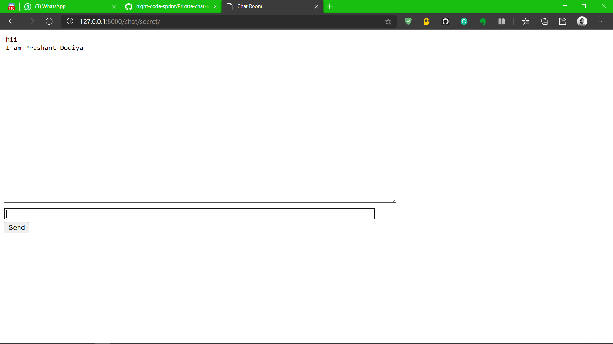

# Project: Private-chat-room "WHISPER"
## Team: Devarriors
### Team Member: Prashant Dodiya (U19EC026)
#### Problem Statement
Each one of us might have experienced that our idea got stolen and with all the credits which we deserved.
Someone just came in from nowwhere and stole our idea. That's not fair, right! 
What if those ideas were going to change our lives, it could be our startup idea, bussiness model, anything.
In this age of digitalization, we use chatapps and discussing our ideas, without even being aware of the risk.
Even, the most secure chat applications, store the messages on the database. 
In short, there is no safe place where we can discuss our ideas in the text mode.
As a solution to this problem, I came up with the idea of "Whisper" - PRIVATE CHAT ROOM,
the website hosting secret chat rooms, where we can freely and securely open up with our ideas, 
without being worried about the risk of getting stolen. 
The main features of the Whisper:
- one with secret password or the invitation email can join the chat
- no storing of messages on the database as soon as all members leaves, room get burnt out.
- feature of friend list for quick and fast invitation

#### Technologies used
- Django Framework
- Django Channel and Websockets

#### Problem faced
- creating the room
- routing

#### Screenshots of Prototype

	
	
