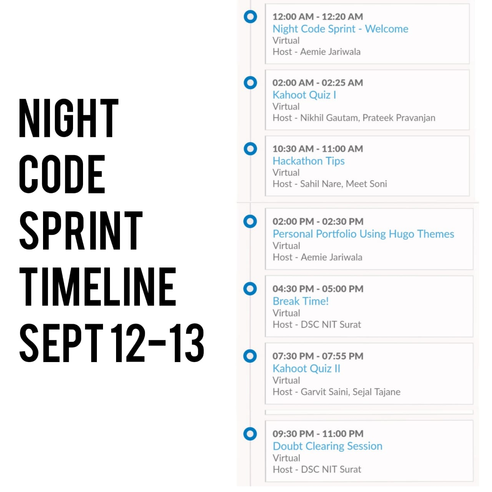
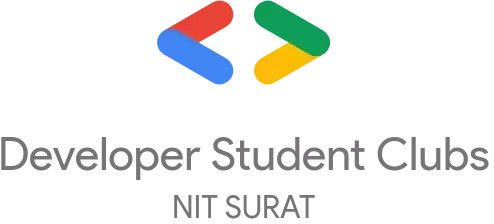

# DSC NIT Surat Night Code Sprint
> You code 'cause you want to explore and grow and with this, you certainly will.

**It will go on for 24 hours**

- Anyone from the institute can participate

- There will be some fun sessions as well

## Timeline 

## Instructions

**Be sure to follow these**

- Use the <a href="https://discord.com/invite/t67Tcrj" target="_blank">discord channel</a> for communication
- For the project you're creating with your respective team or indivdually, use the following steps: 
  1. Fork this repository. 
     Only one member is required to fork this repository. If it is more than one individual participating, invite those team members to collborate on your project.
  2. You'll have a copy of this repository on your github account.
  3. Clone the repository of your copy of the night-code-sprint on the local machine: `git clone https://github.com/<username>/night-code-sprint.git` 
  4. `cd night-code-sprint` and create a new branch as `git checkout -b <branch-name>`. 
      The branch name must be in the following manner `<project-name>`. 
  5. Within this branch create a new folder with the name in the following manner `<project-name>/<team-name>`. Within this folder only, create your project.
  6. For the project, including a README is a must and the admission number of each member must be included as well. 

**For additional help and resources, we have a [reservoir](https://github.com/dsc-nit-surat/reservoir) to help you with the same.**

## Problem Statements (Optional) 
The problem statements are optional to use and are meant for those who are unable to come up with any identification of problem or solution. You're free to solve this problem with any track you're comfortable with or want to try something new! 
1. Chatbot for COVID19
2. Development of online platform for selling old books/equipments
3. Attention Span Detection in Online Instructor Led Sessions
4. SVNIT website

## Tracks
1. Blockchain
2. AI - ML
3. Algorithms
4. AR - VR
5. Computer Vision
6. Women In Safety
7. Fin-Tech
8. Future Mobility
9. Healthcare
10. Open Innovation

**Tips**

- **You Are Free TO Develop Anythin You Want**
- **It Is A Great Way To Show Your Skills**
- **Have Fun!**

## Rewards & Judgement Criteria
Yet to be decided but this event will be full of sessions, exploration, and growing your skills, I can be sure on that.

## Support

Reach out to us at one of the following places!

- Website at <a href="https://dsc-nitsurat.herokuapp.com/" target="_blank">`dsc-nitsurat.herokuapp.com`</a>
- Twitter at <a href="https://twitter.com/dscnit?lang=en" target="_blank">`@DscNit`</a>
- Instagram at <a href="https://www.instagram.com/dsc_nitsurat/?hl=en" target="_blank">`@dsc_nitsurat`</a>
- Facebook at <a href="https://www.facebook.com/dscnitsurat/" target="_blank">`dscnitsurat`</a>
- Discord at <a href="https://discord.com/invite/t67Tcrj" target="_blank">`DSC NIT SURAT`</a>
