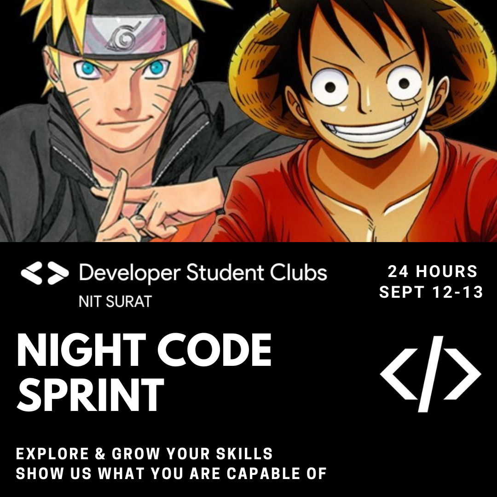

# DSC NIT Surat Night Code Sprint

> It will go on for 24 hours

> Anyone from the institute can participate

> There will be some fun sessions as well

---

## Instructions

> Be sure to follow these

- Use the discord channel for communication
- We will provide a GitHub repo on the DSC github page
- Your project folder should be uploaded in the repo

> Tips

- YOU ARE FREE TO MAKE ANYTHING YOU WANT
- IT IS A GREAT WAY TO SHOW YOUR SKILLS
- HAVE FUN!

---

## Support

Reach out to us at one of the following places!

- Website at <a href="https://dsc-nitsurat.herokuapp.com/" target="_blank">`dsc-nitsurat.herokuapp.com`</a>
- Twitter at <a href="https://twitter.com/dscnit?lang=en" target="_blank">`@DscNit`</a>
- Instagram at <a href="https://www.instagram.com/dsc_nitsurat/?hl=en" target="_blank">`@dsc_nitsurat`</a>
- Facebook at <a href="https://www.facebook.com/dscnitsurat/" target="_blank">`dscnitsurat`</a>

---
