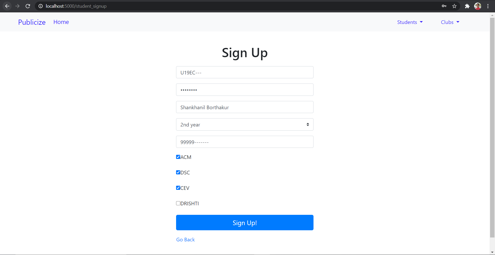
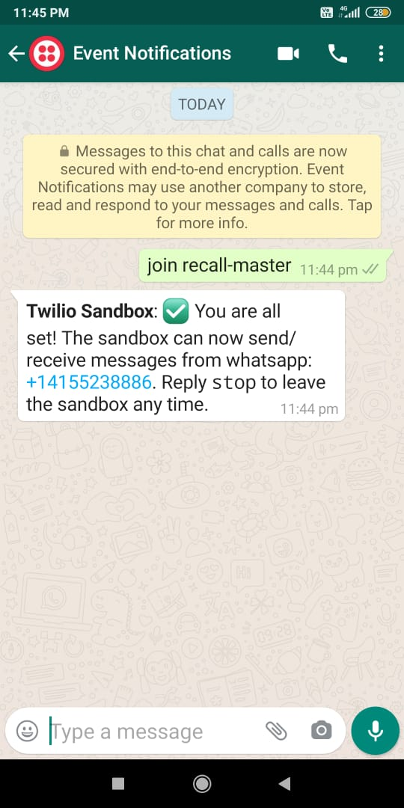
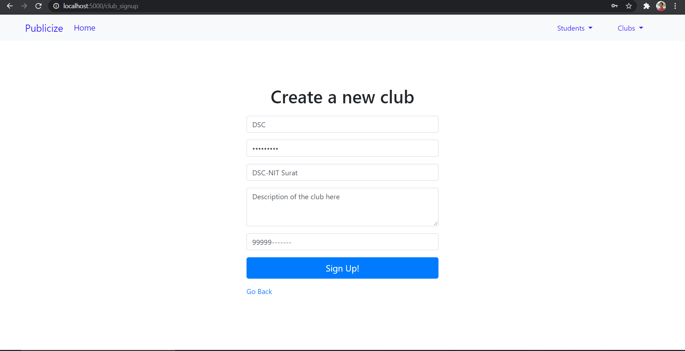
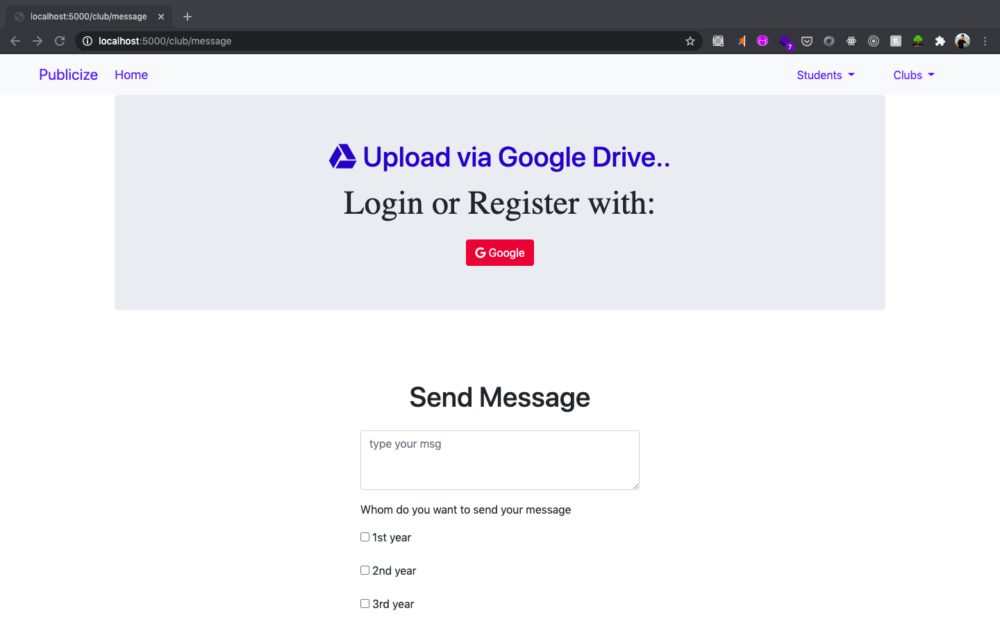
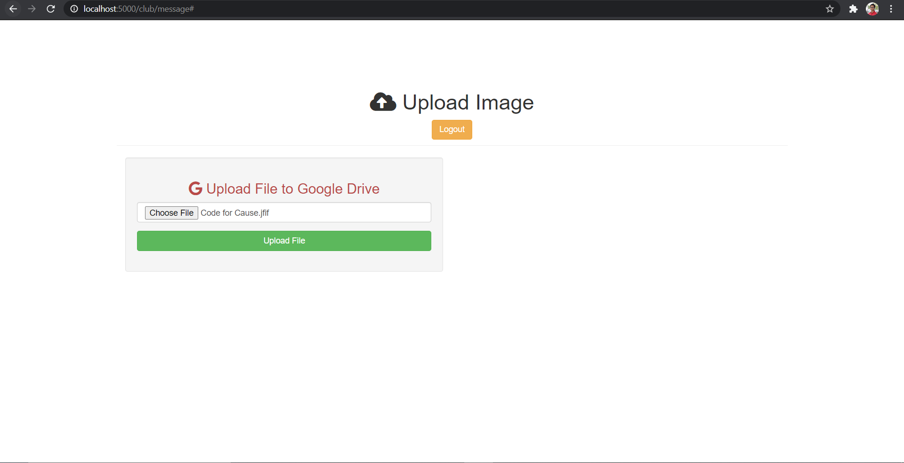
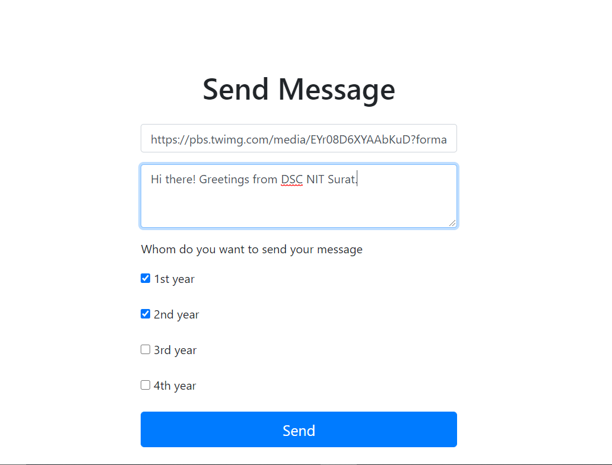
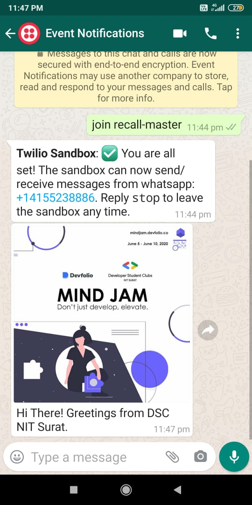
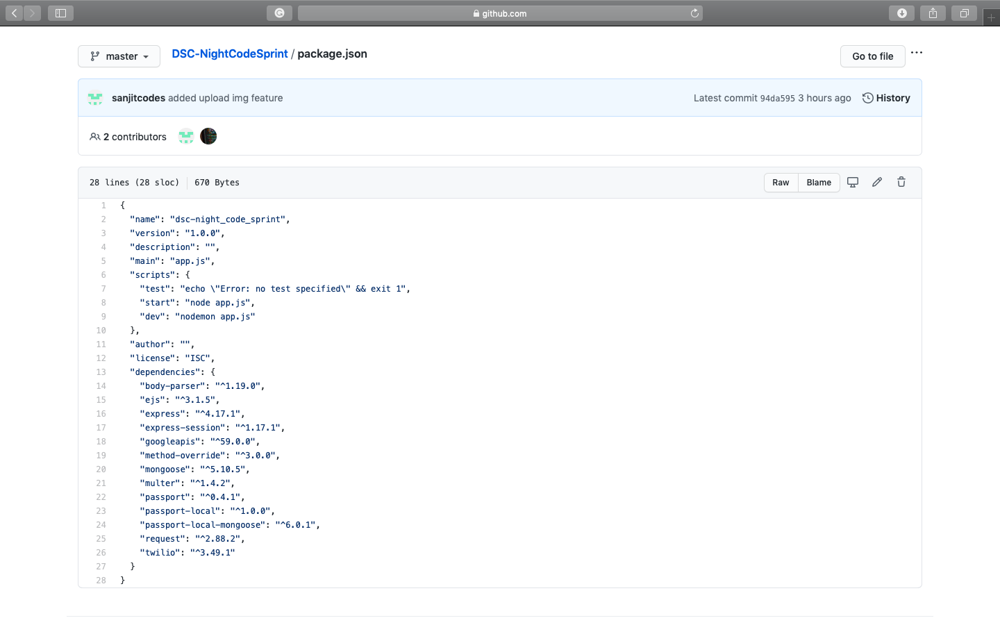

# Publicize

**Team Members:** 

    * Shankhanil Borthakur (U19EC017)
    * Sanjit Anand (U19EC008)

## Project Idea

It often occurs that whenever a club/student chapter wants to notify all the students of college, they rely heavily on their executives to spread the event notification/message on different platforms like WhatsApp, Instagram, Discord, Slack, etc. 
Usually it happens that many executives fail to send the message or even read the message. It becomes difficult for the Core team/Organizers to make everyone aware of the event. Also, most of the people don't tend to open other apps except WhatsApp and they miss out on the notifications which leads to low attendance in events. WhatsApp is something which everyone opens atleast once in 2 hours. 

What we have thought is to make a platform for sending WhatsApp messages of the events of clubs/student chapters directly to all the students registered on our platform. 
This makes it much more convenient for the organizers to send the event message which includes text and images from a single channel on WhatsApp. Also WhatsApp groups have a limit on maximum number of participants. Hence instead of creating several WhatsApp groups, notifications can be easily sent to all registered students with one click in our case. Instead of relying on someone else to propagate the message, our platform will provide an easy and efficient solution.


## Workflow

1. Students of a college need to Sign Up on our website. There they can choose the clubs that they are interested in and want to receive notifications from.

    
  
  
2. The registered students need to add a number **+1(415)523-8886** and save it with any name they wish to call the service. To start receiving messages they need to send a message **join recall-master** to the same number as shown below. 

    


3. The different clubs of a college need to register first to use our features.

    
    

4. This is the dashboard of the Logged In club from where they can send notifications.

    
  

5. We have added a feature wherein you can upload an image on your Google Drive from the site itself.

    

6. Users can enter the google drive link or any other link which provides the required image in the textbox below.

    

7. After filling all the details of the message and sending it, the users will receive the message as shown below.

    


## Tech/framework used
The following tools were used in building this site
* Twilio Sandbox
* Front-end development
  * HTML
  * CSS
  * BootStrap 
  * Semantic UI
  
* Back-end development
  * Javascript
  * Node.js
  * Express.js
  * jQuery
  
* Database used
  * mongodb
  
* Authorisation/Authentication
  * passport.js
  
* Google Drive API 
  * multer
  
  
  
  
  ## Installation
   It is very easy to use our project if anyone wants. Just follow the steps :

1. Firstly if you are working locally then you need to install the following :
    * Node.js
    * MongoDB
    * VS Code ( recommended , Any other suitable code editor will work )
  
2. Next you need to clone our project's GitHub repository to your desktop 

3. Open command line navigate to the project folder. Then type the following commands to install required dependencies :
     ```javascript
      npm install async, body-parser, connect-flash, ejs, express, express-session, locus, method-override, mongoose, passport, passport-     local, passport-local-mongoose, puppeteer, request, multer, googleapis --save
     ```
4. Your package.json should look like this with the following dependencies
    
    

     
6. After successful installation run the following command to start the application :
      ```javascript
       npm run dev
      ```
   If you see *Server Has Started!!* then you have successfully setup everything and good to go with our application.


## Contribute
Although we have tried our best to make our application robust and secure, errors might have crept in. If you have any ideas, just [open an issue](https://github.com/shankhanil007/DSC-NightCodeSprint/issues) and tell us what you think.

If you'd like to contribute, please fork the repository and make changes as you'd like. Pull requests are warmly welcome.

  1. Fork it (https://github.com/shankhanil007/DSC-NightCodeSprint/fork)
  2. Create your own branch (git checkout -b <branch_name>)
  3. Commit your changes (git commit -m 'Added new auth feature')
  4. Push to the branch (git push origin <branch_name>)
  5. Create a new Pull Request
