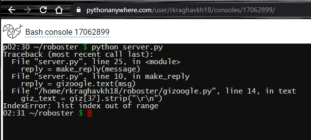
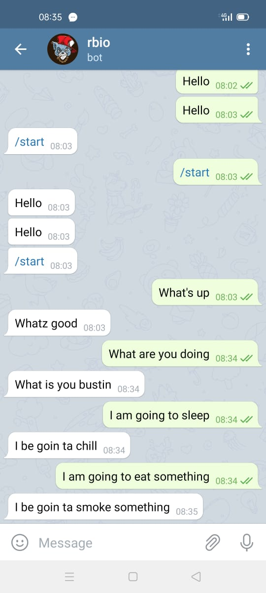

# roboster

> Idea for [night-code-sprint](https://github.com/dsc-nit-surat/night-code-sprint/) hackathon.

Just want to make a simple robo gangster chatbot on telegtam which responds you in gangsta way . It was fun making my first chatbot great experience would love to make more bots in future.
By just using python and https command made this .Inspiration was alexa ,google-assistant , siri althouh it's a huge-huge difference . Try it,you'll have a fun talk with him. 

## Issues faced:

Facing issue while putting the server online , it wasn't working but surely there's a way .

## Installing

If the server is not running on any machine then ,
To get this running in your local machine follow the instruction:

1. Clone the repository in which it contains

2. Run the files in your local pc.

In the end ,  you have to search roboster or reccentricbot on telegram and start talking with your roboster. 

## Bot roboster

## Built with 

* [TelegramChatbot](https://core.telegram.org/bots/)-Bots are third-party applications that run inside Telegram. Users can interact with bots by sending them messages, commands and inline requests. You control your bots using HTTPS requests to our Bot API.

## Contributors 
* **Raghav Khandelwal - U19CH091** - [rkraghavkh18](https://github.com/rkraghavkh18)